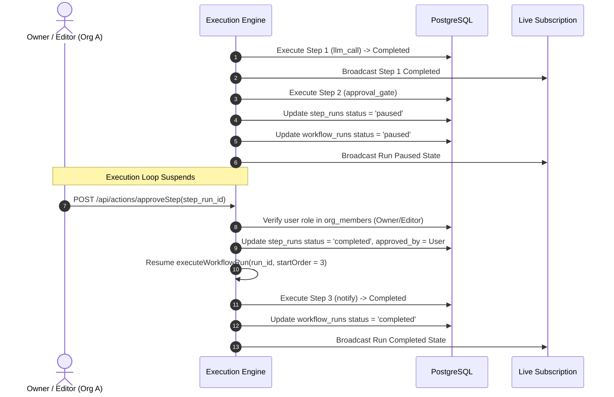

# Technical Architecture & Security Write-Up — AI Agent Workflow Builder

## 1. Schema Reasoning & Design

The relational database schema is modeled in PostgreSQL to support multi-tenant isolation, step order control, dynamic triggers, and mid-execution approval gating:

- **`organizations` & `org_members`**: Multi-tenant foundation with composite unique constraints on `(org_id, user_id)` and role definitions (`owner`, `editor`, `viewer`). Monthly execution quotas (`calls_used`, `calls_allowed`) are stored on `organizations` and evaluated transactionally prior to starting any run.
- **`workflows`, `workflow_steps`, `workflow_triggers`**: Workflows belong strictly to an `org_id`. Steps are ordered sequentially via integer `step_order` and store type-specific configuration inside Postgres `JSONB` fields (`config`), allowing dynamic JSON interpolation without schema migrations.
- **`workflow_runs` & `step_runs`**: Execution state machine tables. `workflow_runs` tracks the overall status (`pending` -> `running` -> `paused` -> `completed` | `failed`), while `step_runs` logs individual step attempts (`attempt_count`), status, input, output JSON, error tracebacks, and approval audit metadata (`approved_by`, `approved_at`).
- **`workflow_results` & `watched_events`**: Supporting tables for high-privilege `db_write` step persistence and `db_event` database triggers.

---

## 2. Dual-Layer Permissions Enforcement

Permission enforcement is divided into two strict, complementary layers to prevent unauthorized data access or sensitive operation execution:

```
+-----------------------------------------------------------------------+
| LAYER 1: Hasura Row-Level Security (RLS) & Org Scoping               |
| Enforces org_id = x-hasura-org-id on SELECT / INSERT / UPDATE         |
| Role hierarchy: owner (full) | editor (no members) | viewer (read-only)|
+-----------------------------------------------------------------------+
                                  |
                                  v
+-----------------------------------------------------------------------+
| LAYER 2: Step-Level Gating & Action Mid-Execution Authorization      |
| Backend Action Handlers inspect user role in org_members table        |
| Restricts db_write, notify, webhook creation to 'owner'               |
| Validates approver has role IN ('owner', 'editor') to clear paused gate|
+-----------------------------------------------------------------------+
```

### Layer 1: Org + Role Scoping (Row-Level Security)
Every GraphQL query, mutation, and subscription carries session context (`x-hasura-org-id`, `x-hasura-user-id`, `x-hasura-role`).
Hasura metadata rules filter all database operations by `org_id: { _eq: "x-hasura-org-id" }`.
Even if an attacker from Org B guesses a valid workflow UUID or run UUID belonging to Org A, the GraphQL Engine applies the RLS filter and returns 0 rows (HTTP 403 / empty result set). Role permissions enforce:
- **`owner`**: Full CRUD on `workflows`, `workflow_steps`, `workflow_triggers`, `workflow_runs`, `org_members`.
- **`editor`**: CRUD on `workflows`, `workflow_steps`, `workflow_triggers`, `workflow_runs`. Read-only access to `org_members` (cannot change user roles).
- **`viewer`**: Read-only SELECT access. Cannot create/modify workflows or trigger execution runs.

### Layer 2: Step-Level Gating & Mid-Execution Action Authorization
Certain step types (`db_write`, `notify`) reach outside the sandbox and present security risks if misconfigured by non-owner roles:
1. **Step Creation/Edit Gating**: The `/api/actions/saveWorkflow` handler checks `org_members` for the caller's role. If the workflow contains `db_write`, `notify`, or `webhook` triggers, the operation requires `role == 'owner'`.
2. **Approval Gate Resolution**: Clearing a paused `approval_gate` step cannot rely on static row permissions alone because it occurs mid-execution. When `/api/actions/approveStep` is invoked with a `step_run_id`, the Action handler queries `org_members` for the caller's `(org_id, user_id)` pair and verifies that `role IN ('owner', 'editor')`. Attempting to approve from a `viewer` session or cross-org session is rejected with `UNAUTHORIZED_APPROVAL` (403).

---

## 3. Approval-Gate Pause & Resume Implementation



1. **Pause Detection**: When the execution engine reaches an `approval_gate` step node in `executor.js`, it updates `step_runs` status to `paused` with output metadata, updates `workflow_runs` status to `paused`, emits a GraphQL subscription update, and exits the loop without incrementing `calls_used`.
2. **State Persistence**: The run remains in state `paused` inside PostgreSQL indefinitely.
3. **Resume Execution**: When an authorized user invokes `approveStep(step_run_id)`, the Action handler verifies the user's role in `org_members`, sets `step_runs.status = 'completed'`, and triggers `executeWorkflowRun(runId, nextOrder)`, resuming the remaining step pipeline seamlessly.
